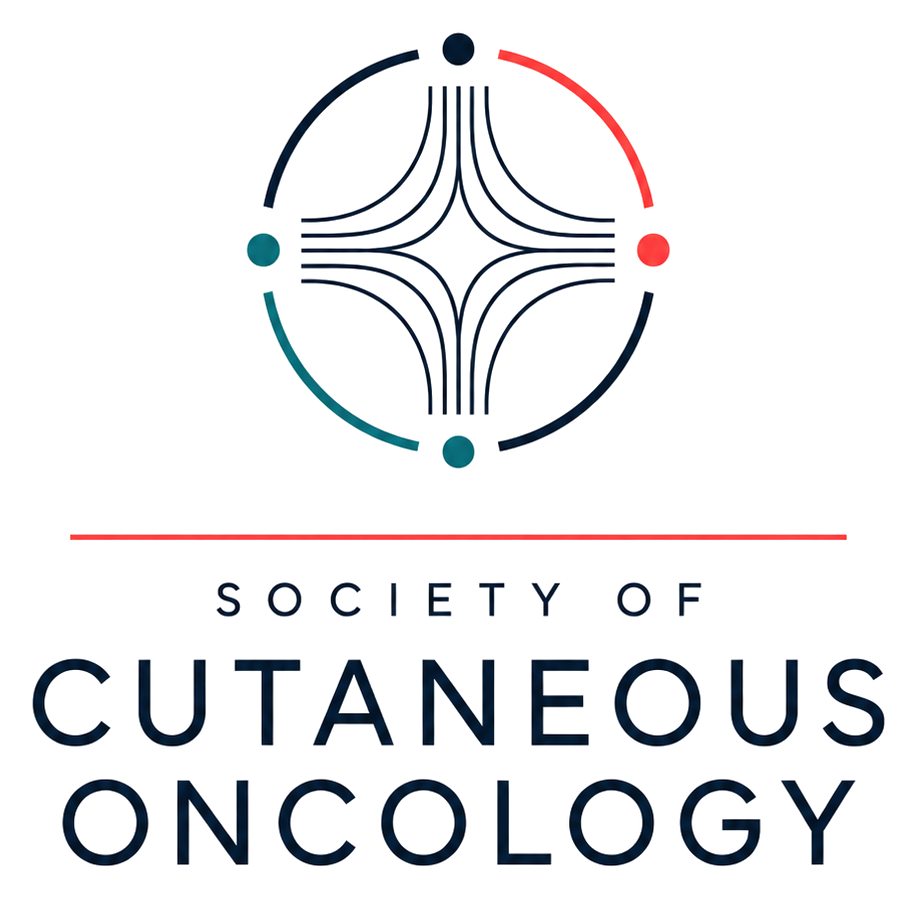

::: {.soco-hero}
::: {.soco-hero-inner}

::: {.soco-hero-mark}
{alt="Society of Cutaneous Oncology logo" .soco-hero-logo}
:::

::: {.soco-hero-copy}

Evidence • Collaboration • Reproducible Science

<h1 class="soco-mission-headline">
  Interpreting evidence.
  Building community.
  Advancing care.
</h1>

The Society of Cutaneous Oncology is a multidisciplinary community of clinicians and investigators committed to improving outcomes for patients with skin cancer through evidence interpretation, collaborative science, and education.

::: {.soco-actions}
[Explore the Journal](joco.qmd){.btn .btn-primary}
[Journal Club](jc.qmd){.btn .btn-outline-primary}
[Research Forum](research_forum.qmd){.btn .btn-outline-primary}
:::
:::

:::
:::

[Scroll](#our-mission){.soco-scroll-cue}

::: {.soco-section #our-mission}
## Our mission

The Society of Cutaneous Oncology brings together clinicians, scientists, trainees, and allied professionals dedicated to advancing the care of patients with skin cancer.

::: {.soco-card-grid}

::: {.soco-card}
### Interpret evidence

We review emerging data in cutaneous oncology and help translate evidence into thoughtful clinical practice.
:::

::: {.soco-card}
### Support reproducible science

We create forums for investigators to share methods, refine ideas, and develop collaborative projects.
:::

::: {.soco-card}
### Educate the field

We support clinicians, scientists, and trainees committed to the future of cutaneous oncology.
:::

:::
:::

::: {.soco-section .soco-platforms}
## SoCO programs

::: {.soco-card-grid}

::: {.soco-card}
### Journal of Cutaneous Oncology

An open-access journal focused on skin cancer, evidence interpretation, and perspectives from the cutaneous oncology community.

[Visit the journal](joco.qmd){.soco-card-link}
:::

::: {.soco-card}
### SoCO Journal Club

A recurring multidisciplinary forum for discussion of recent articles and emerging evidence in skin cancer.

[View Journal Club](jc.qmd){.soco-card-link}
:::

::: {.soco-card}
### Research Forum

A collaborative space for investigators to present ideas, share work in progress, and develop multicenter projects.

[Visit Research Forum](research_forum.qmd){.soco-card-link}
:::

:::
:::