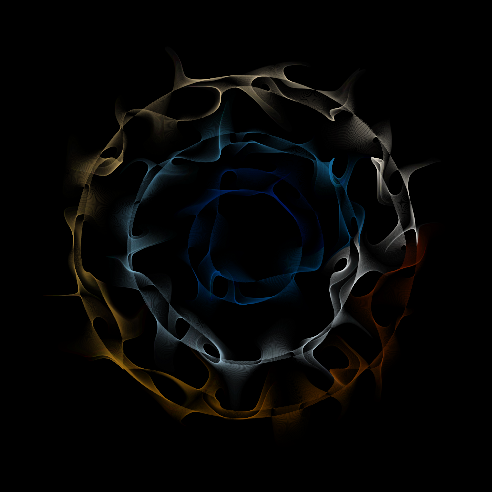

::::: {.forum-entry-hero}
:::: {.forum-entry-hero-inner}

::: {.forum-entry-eyebrow}
SoCO Research Forum · Scientific Review
:::

# To Accept, Revise, or Reject: The Art of the Review

::: {.forum-entry-subtitle}
A discussion of how scientists approach peer review—from why we agree to review, to how we evaluate a manuscript, communicate criticism, manage conflicts, and decide what recommendation to make.
:::

::: {.forum-entry-tags}
[Scientific Review]{.forum-entry-tag}
[Peer Review]{.forum-entry-tag}
[Scientific Publishing]{.forum-entry-tag}
[Editorial Process]{.forum-entry-tag}
:::

::::
:::::

::::: {.forum-entry-shell}
:::: {.forum-entry-card}

::: {.forum-entry-meta}

::: {.forum-entry-meta-item}
[Program]{.forum-entry-meta-label}

[SoCO Research Forum]{.forum-entry-meta-value}
:::

::: {.forum-entry-meta-item}
[Presenter]{.forum-entry-meta-label}

[David M. Miller]{.forum-entry-meta-value}
:::

::: {.forum-entry-meta-item}
[Date]{.forum-entry-meta-label}

[May 12, 2023]{.forum-entry-meta-value}
:::

:::

:::: {.forum-entry-content}

::: {.forum-entry-profile .fade-in}

{alt="The Art of the Review presentation graphic"}

::: {.forum-entry-profile-copy}
[The Art of the Review]{.forum-entry-profile-title}

::: {.forum-entry-profile-subtitle}
A practical discussion of the scientific review process from the perspectives of authors, reviewers, and editors.
:::
:::

:::

::: {.forum-entry-section .fade-in}

## The central question

Peer review sits at the center of scientific publishing, yet most investigators learn how to review manuscripts informally—through experience, mentorship, and exposure to reviews written by others.

This Research Forum session examined different approaches to the review process and asked what makes a review rigorous, constructive, fair, and genuinely useful to authors and editors.

:::

::: {.forum-entry-takeaway .fade-in}
[Central Idea]{.forum-entry-takeaway-label}

A good review does more than identify flaws. It helps determine whether the scientific question is important, whether the evidence supports the claims being made, and what would be required to make the work stronger.
:::

::: {.forum-entry-section .fade-in}

## The reviewer’s task

::: {.forum-entry-grid}

::: {.forum-entry-mini-card}
### Evaluate the science

Is the question meaningful, the design appropriate, the analysis credible, and the interpretation proportional to the evidence?
:::

::: {.forum-entry-mini-card}
### Separate major from minor

Distinguish issues that threaten validity or interpretation from changes that would merely improve presentation.
:::

::: {.forum-entry-mini-card}
### Be constructive

Criticism should help the author understand both what is wrong and, where possible, how the work could be improved.
:::

::: {.forum-entry-mini-card}
### Advise the editor

The review is not only a message to the authors. It is also an assessment for the editor about whether the manuscript is suitable for publication.
:::

:::

:::

::: {.forum-entry-section .fade-in}

## A snapshot from the room

A brief audience survey during the session captured how participants experienced the peer-review process. Twelve responses were recorded. These results are descriptive and represent this small group rather than the broader scientific community.

::: {.survey-grid}

::: {.survey-card}
[12 / 12]{.survey-value}
[Authors + Reviewers]{.survey-label}

Every respondent identified as both an author and a reviewer.
:::

::: {.survey-card}
[5 / 12]{.survey-value}
[Editors]{.survey-label}

Five participants also reported serving in an editorial role.
:::

::: {.survey-card}
[6 / 12]{.survey-value}
[≥10 Invitations]{.survey-label}

Half reported having been asked to review at least 10 manuscripts.
:::

::: {.survey-card}
[7 / 12]{.survey-value}
[≥90 Minutes]{.survey-label}

Seven respondents reported typically spending at least 90 minutes completing a review.
:::

::: {.survey-card}
[8 / 12]{.survey-value}
[Support Compensation]{.survey-label}

Eight respondents indicated that reviewers should receive compensation.
:::

::: {.survey-card}
[5 / 11]{.survey-value}
[Double-Blind Preferred]{.survey-label}

Among the 11 who answered, double-blind review was the most frequently selected approach; open and closed review each received three selections.
:::

:::

:::

::: {.forum-entry-section .fade-in}

## Review experience and incentives

The survey suggested a group with meaningful experience but mixed views about how the review system should recognize that work.

::: {.forum-entry-grid}

::: {.forum-entry-mini-card}
### Review volume

Two respondents reported reviewing at least 10 papers, one reported 7–9, five reported 4–6, and four reported 1–3.
:::

::: {.forum-entry-mini-card}
### Time commitment

Three reported 60–89 minutes per review, four reported 90–119 minutes, and three reported 120 minutes or more. Only two reported 30–59 minutes.
:::

::: {.forum-entry-mini-card}
### Incentives

Only 2 of 12 respondents described themselves as currently incentivized to review.
:::

::: {.forum-entry-mini-card}
### Paid review

Five respondents said reviewers should be paid, while eight supported some form of compensation more broadly.
:::

:::

:::

::: {.forum-entry-takeaway .fade-in}
[The Time Burden]{.forum-entry-takeaway-label}

In this small group, peer review was rarely a quick task: 10 of 12 respondents reported spending at least an hour on a typical review, and 7 of 12 reported spending 90 minutes or longer.
:::

::: {.forum-entry-section .fade-in}

## Why do reviewers say yes?

The survey responses reflected several different motivations for accepting review invitations.

::: {.forum-entry-topics}

- A desire to improve the field.
- The opportunity to read emerging science.
- A sense of academic duty.
- The chance to improve critical-thinking skills.
- Invitations from colleagues or mentors.
- Feeling honored to be asked.
- Professional recognition and CV development.

:::

The responses reinforce that peer review can simultaneously function as scientific service, intellectual engagement, professional development, and quality control.

:::

::: {.forum-entry-section .fade-in}

## Conflicts, anonymity, and trial review

The survey also surfaced some of the less visible judgments reviewers routinely make.

::: {.forum-entry-grid}

::: {.forum-entry-mini-card}
### Conflict of interest

Four of 11 respondents with available data answered “yes” to one conflict-of-interest scenario, while seven answered “yes” to a second scenario—illustrating that perceived conflicts can depend heavily on context.
:::

::: {.forum-entry-mini-card}
### Review model

Preferences were divided: five selected double-blind review, three open review, and three closed review.
:::

::: {.forum-entry-mini-card}
### Trial review

Four of 11 respondents with available data reported prior experience reviewing a clinical trial manuscript.
:::

::: {.forum-entry-mini-card}
### Formal training

None of the 12 respondents reported having completed a formal course in peer review.
:::

:::

:::

::: {.forum-entry-takeaway .fade-in}
[An Informal Apprenticeship]{.forum-entry-takeaway-label}

Everyone in the room had reviewed manuscripts, but no respondent reported formal coursework in how to do it. Peer review remains, for many scientists, a skill learned largely by apprenticeship.
:::

::: {.forum-entry-section .fade-in}

## Questions explored

The discussion extended beyond how to critique a manuscript and into the structure of peer review itself.

::: {.forum-entry-grid}

::: {.forum-entry-mini-card}
### Open or anonymous?

What are the tradeoffs among open, closed, single-blind, and double-blind approaches to peer review?
:::

::: {.forum-entry-mini-card}
### Incentives

Should reviewers be compensated, formally recognized, or otherwise rewarded for the time and expertise that peer review requires?
:::

::: {.forum-entry-mini-card}
### Conflicts of interest

When does scientific proximity become a conflict, and when is subject-matter expertise precisely why a reviewer should be selected?
:::

::: {.forum-entry-mini-card}
### Accept, revise, or reject?

How should reviewers distinguish work that is fundamentally flawed from work that can become publishable through revision?
:::

:::

:::

::: {.forum-entry-section .fade-in}

## Research Forum focus

The session approached peer review as a scientific skill rather than an administrative task. The aim was to make the review process more explicit: how to read a paper critically, how to structure comments, how to calibrate recommendations, and how to provide criticism that is rigorous without becoming performative or unnecessarily adversarial.

For authors, reviewers, and editors alike, the broader goal is the same: improve the quality, clarity, and interpretability of the scientific record.

::: {.forum-entry-links}
[Research Forum](../../research_forum.qmd){.forum-entry-link}
[Presentation Archive](../../research_forum.qmd#presentations){.forum-entry-link .secondary}
:::

:::

::: {.forum-entry-note}
Audience survey results shown here are descriptive summaries of 12 responses collected during the May 12, 2023 Research Forum session. Some individual survey items had one missing response; denominators are shown where relevant.
:::

::::
::::
:::::

