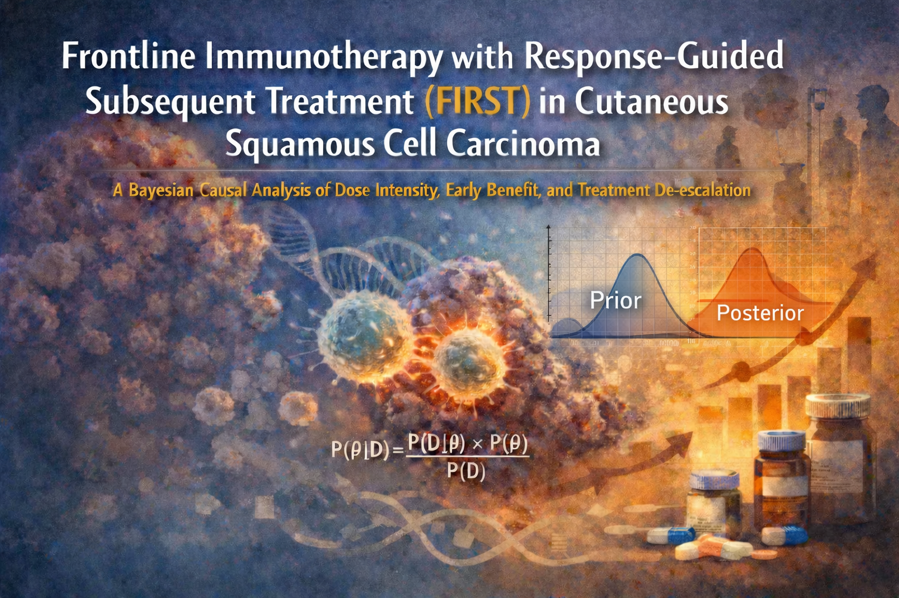

::: {.soco-lead-image}
{alt="FIRST presentation title slide"}
:::

## Presentation

**Frontline Immunotherapy with Response-Guided Subsequent Treatment (FIRST) in Cutaneous Squamous Cell Carcinoma**  
*A Bayesian Causal Analysis of Dose Intensity, Early Benefit, and Treatment De-escalation*

Presented at the **Society of Cutaneous Oncology Research Forum** in April 2026.

## Summary

This Research Forum session reviewed the FIRST analysis in cutaneous squamous cell carcinoma, focusing on response-guided treatment, dose intensity, early clinical benefit, and the possibility of treatment de-escalation after frontline immunotherapy.

The discussion emphasized how Bayesian causal methods may help interpret non-randomized treatment patterns and generate clinically meaningful hypotheses about treatment duration, dose intensity, and response-adapted care.
